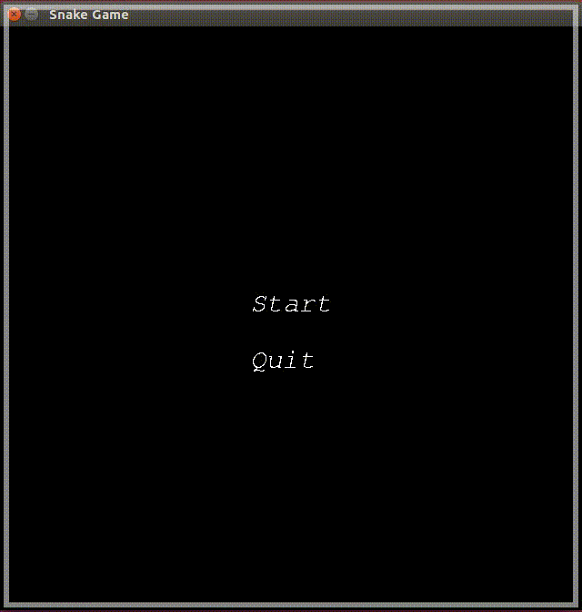

# CPPND: Capstone Snake Game

This project extends C++ Nanodegree Capstone project called Snake game. It includes mainly two screens: Context menu and game viewer.
One can switch between these two screens using an ESCAPE key.

Projct meets the following rubric points:
* The project demonstrates an understanding of C++ functions and control structures.
* The project accepts user input and processes the input.
* The project uses Object Oriented Programming techniques.
  * Classes use appropriate access specifiers for class members.
* Class constructors utilize member initialization lists.
* The project makes use of references in function declarations.

## Dependencies for Running Locally
* cmake >= 3.7
  * All OSes: [click here for installation instructions](https://cmake.org/install/)
* make >= 4.1 (Linux, Mac), 3.81 (Windows)
  * Linux: make is installed by default on most Linux distros
  * Mac: [install Xcode command line tools to get make](https://developer.apple.com/xcode/features/)
  * Windows: [Click here for installation instructions](http://gnuwin32.sourceforge.net/packages/make.htm)
* SDL2 >= 2.0
  * All installation instructions can be found [here](https://wiki.libsdl.org/Installation)
  * Note that for Linux, an `apt` or `apt-get` installation is preferred to building from source.
    * sudo apt install libsdl2-dev
    * sudo apt-get install libsdl2-dev
* SDL2 TTF >= 2.0
  * All installation instructions can be found [here](https://www.libsdl.org/projects/SDL_ttf/docs/SDL_ttf.html)
  * Note that for Linux, an `apt` or `apt-get` installation is preferred to building from source.
    * sudo apt install libsdl2-ttf-dev
    * sudo apt-get install libsdl2-ttf-dev
* gcc/g++ >= 5.4
  * Linux: gcc / g++ is installed by default on most Linux distros
  * Mac: same deal as make - [install Xcode command line tools](https://developer.apple.com/xcode/features/)
  * Windows: recommend using [MinGW](http://www.mingw.org/)

## Build Instructions
1. Clone this repo.
2. Make a build directory in the top level directory: `mkdir build && cd build`
3. Compile: `cmake .. && make`
4. Run it: `./SnakeGame`.
